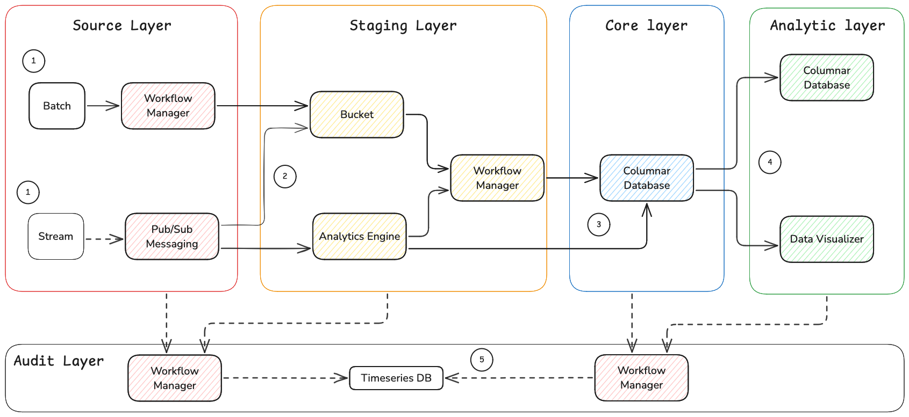
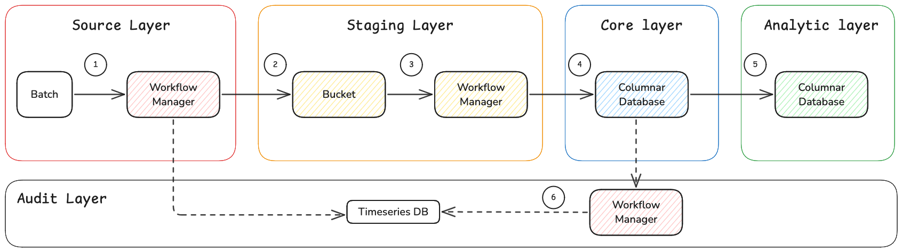
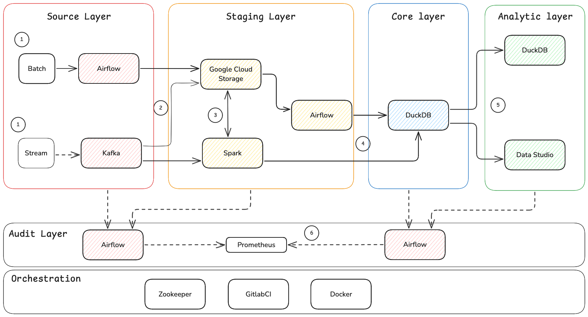
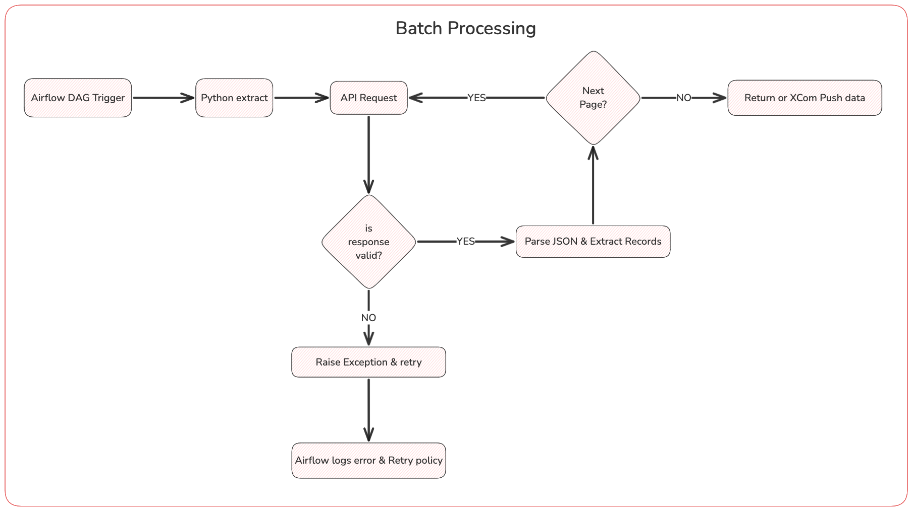
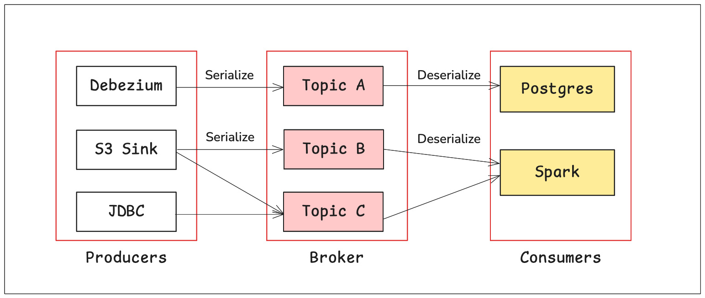
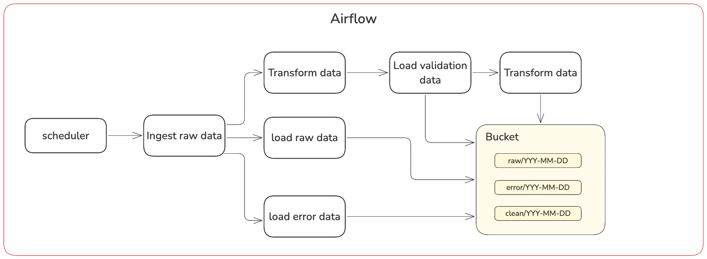
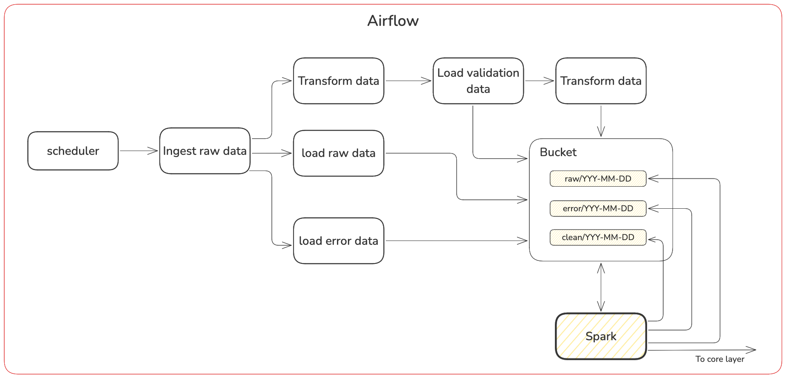
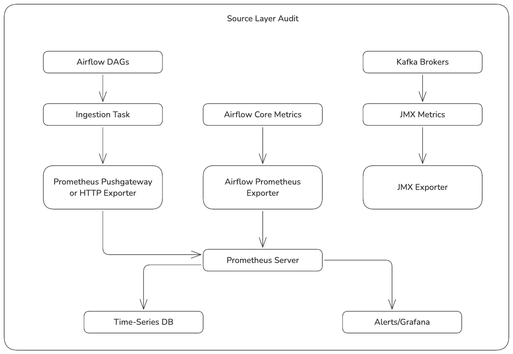
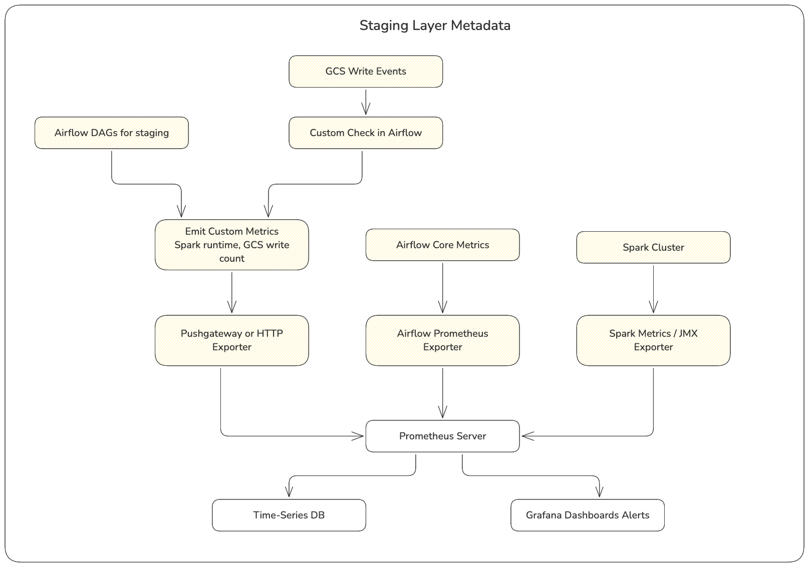
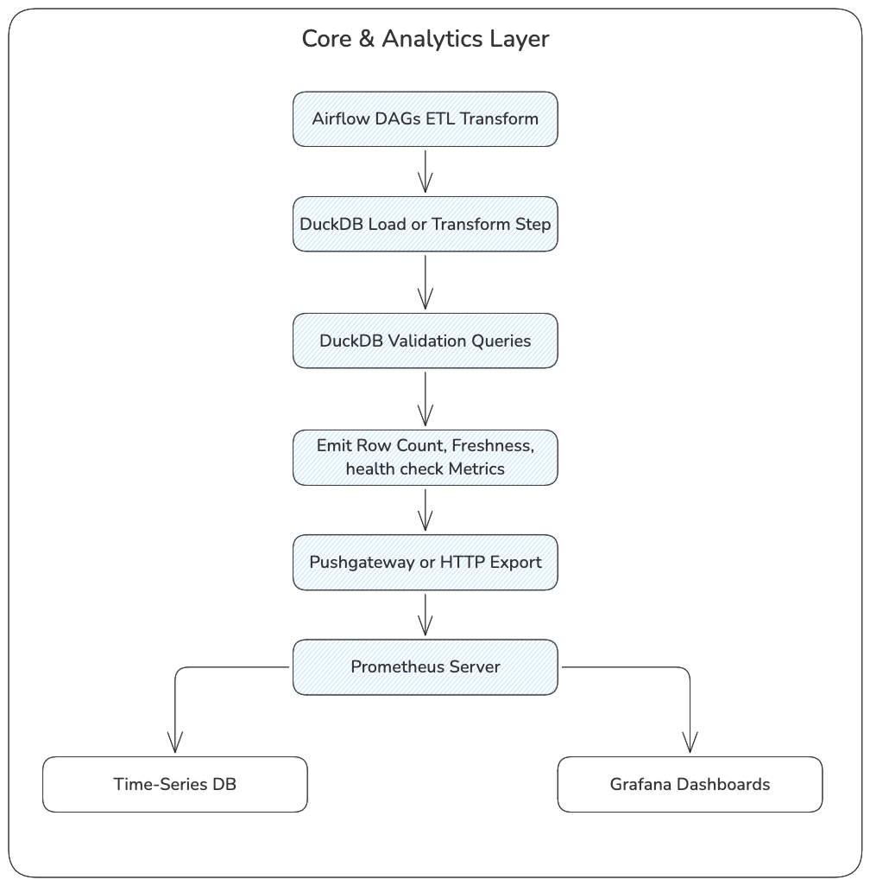

<h1> Test02 </h1>

This document outlines a comprehensive design and strategy for building an efficient, scalable data warehouse architecture. The design employs a multi-layered approach that ensures data quality, security, and performance.

# Table of Content
- [Table of Content](#table-of-content)
- [Architecture Overview](#architecture-overview)
  - [Dataflow Design](#dataflow-design)
  - [Technology Stack](#technology-stack)
- [Source Data Layer](#source-data-layer)
  - [Collecting Batch Data](#collecting-batch-data)
  - [Ingesting Stream Data](#ingesting-stream-data)
    - [Performance](#performance)
    - [Further perfomance improvement](#further-perfomance-improvement)
- [Staging Layer](#staging-layer)
  - [Handling Large Volume](#handling-large-volume)
  - [Stream Processing](#stream-processing)
- [Core Layer](#core-layer)
- [Analytics Layer](#analytics-layer)
  - [Pre-Aggregated Summary Tables](#pre-aggregated-summary-tables)
  - [Flattened Views for Semantic Simplicity](#flattened-views-for-semantic-simplicity)
  - [Why These Design Patterns Work Well in DuckDB](#why-these-design-patterns-work-well-in-duckdb)
- [Metadata Layer](#metadata-layer)
  - [How Prometheus Monitors Source Layers with Airflow and Kafka](#how-prometheus-monitors-source-layers-with-airflow-and-kafka)
  - [How Prometheus Monitors the Staging Layer with Spark, GCS, and Airflow](#how-prometheus-monitors-the-staging-layer-with-spark-gcs-and-airflow)
    - [How Prometheus Monitors the Core and Analytics Data Layers with DuckDB](#how-prometheus-monitors-the-core-and-analytics-data-layers-with-duckdb)


# Architecture Overview

A modern data warehouse embraces a **modular, layer-based architecture** that cleanly separates data ingestion, transformation, storage, and consumption. This separation of concerns is not merely for organization—it directly impacts the **scalability, availability**, and **performance** of the entire system. 

True scalability isn’t just about handling more data; it’s about doing so efficiently, selectively, and without over-provisioning. High availability depends on the ability to **monitor**, **degrade gracefully**, and **recover** quickly. Performance, in turn, often comes down to resource orchestration more than raw code optimization.

Below are key design principles that reinforce these goals:
- **Separation of Concerns Enables Elastic Scaling**  
    Layers must be able to **scale independently** based on workload patterns. For example, transformation layers may need to scale out temporarily during peak ingestion windows, while reporting layers remain idle. Likewise, **components can be spun down** when not needed, reducing cost and improving system availability by minimizing unnecessary surface area.
- **Scalability Is Bidirectional**  
    The architecture must support both **scale-up** (adding resources for heavier processing) and **scale-down** (releasing compute for cost-efficiency). This flexibility is critical for systems that handle highly variable workloads—like hourly batch loads and interactive dashboards running in parallel.
- **Performance Is a Resource Management Problem**  
    Rather than relying solely on code optimization, since sometimes software engineer is more expensive than commodity computer, modern systems often improve performance by **allocating more compute or memory**—especially for I/O-heavy tasks like joins or aggregations. The ability to dynamically adjust resources is a performance enabler.
- **Shared Tools Across Layers**  
    While responsibilities are layered, the tools used need not be isolated. For instance, DuckDB or Spark may appear in both the **staging** and **reporting** layers depending on usage. Separation is about _purpose_, not always _technology_.
- **Observability Drives Availability**  
    Every data flow, ingestion checkpoint, and processing component must be **observable**. By tracking tool health and pipeline checkpoints with systems like **Prometheus** or **OpenTelemetry**, the platform ensures fast issue detection, reproducibility, and recoverability—critical components of high availability.
- **Store What Fails, Not Just What Works**  
    A robust warehouse retains **raw, failed, and partial data** alongside transformed outputs. This ensures **auditabiity**, supports **backfill** scenarios, and provides a **fallback** when transformations break or upstream data quality shifts. It also enhances incident response, making the system more resilient and available.
- **Composable Systems, Not Monoliths**  
    Modularity means you can install or use only the components relevant to a specific data context. For example, ephemeral compute for transformations doesn’t need long-running servers. This reduces operational burden and aligns with cloud-native principles of _ephemeral compute + persistent storage_.

## Dataflow Design

All data begins its lifecycle in one of two fundamental modes: **batch** or **stream**. Each mode dictates not just how data is collected but also how it's processed, stored, and orchestrated throughout the data architecture.

- **Batch processing** involves collecting data over a defined time window and processing it in bulk. This form is **time-driven**, meaning jobs run on scheduled intervals (e.g., hourly, daily). Examples include generating daily reports or aggregating system logs. While batch processing offers predictability and efficiency when working with large datasets, it naturally incurs **higher latency**, often ranging from minutes to hours. However, this delay is tolerable—and even desirable—in many use cases where data completeness is prioritized over speed.
- **Stream processing**, by contrast, is **event-driven**. Data is ingested in real time and processed with very low latency—often in **milliseconds to seconds**. It's ideal for use cases like fraud detection, real-time monitoring, and IoT telemetry. Stream processing requires a persistent **pub/sub architecture** and is designed for handling continuous data flows with low memory footprint per event, but introduces challenges in **ordering, fault tolerance**, and **exactly-once semantics**.

Batch data can arrive as **structured, semi-structured**, or even **unstructured** (e.g., CSV, JSON, logs, video). Stream data, though often semi-structured (e.g., JSON, Avro), frequently starts as **unstructured** sensor or event logs and gains schema during transformation. In both cases, data is first staged and enriched before becoming fully structured.


<center>1. Architecture Overview.png</center>

1. **Source Layer: Batch & Stream Entry Points**  
    Batch data is handled via workflow orchestrator that schedules and manages ETL pipelines using scripts, while in-memory database provides queueing for task coordination. In parallel, stream data is managed by a distributed pub/sub system that can scale horizontally, have a strong durability, and strong ordering guarantees. This separation allows independent scalability and selective deployment based on use case.

2.  **Staging Layer: Buckets for Raw + Failed Data**  
    All incoming data—including raw, malformed, and failed records—is stored in Bucket. This ensures availability and can be audited easily. 

3. **Staging Layer: Analytics Engine for Processing**  
    If incoming data is extremely large, it is processed via Analytics engine. Spark is chosen for its distributed execution model and transforms raw data into a normalized, **semi-structured** format such as **Parquet** or **Avro**, ready for efficient downstream querying.

4. **Core Layer: Columnar Database for Query Performance**  
    Transformed datasets are loaded into Columnar Database, a lightweight OLAP engine optimized for **columnar storage** and **analytical queries**. Fact and dimension modeling is employed:
    - **Fact tables** (e.g., `transaction_fact`) store transactional metrics.
    - **Dimension tables** (e.g., `account_dimension`, `time_dimension`) provide human-readable attributes for filtering and joining. This model accelerates BI queries by minimizing I/O and supporting vectorized execution.

5. **Analytics Layer: Data Marts & Visualizer**  
    Columnar Database provides **data marts**—smaller, pre-joined or pre-aggregated tables optimized for reporting. These are exposed to **Tableau** or **Google Data Studio**, where dashboards are created for operational and strategic decision-making. Since data marts are pre-modeled, users avoid complex joins, improving dashboard latency and interactivity.

6. **Monitoring & Metadata: Time-Series Intelligence**  
    Every stage—from ingestion to transformation and loading—is monitored using **Prometheus**, a time-series database optimized for **high-cardinality metrics** and **real-time alerting**. It tracks:
    - Tool health (Airflow, Kafka, Spark)
    - Data freshness and latency
    - Failed pipeline retries
    - Throughput and storage usage: Time-series DBs like Prometheus are perfect for telemetry because they efficiently compress time-indexed metrics, support retention policies, and integrate with alerting tools (e.g., Grafana or Alertmanager).

The architecture is **loosely coupled**. That means:
- You can run only **batch ingestion** if streaming is not yet needed.
- You can **detach the monitoring layer** without disrupting ingestion or transformation.
- You can **replace Spark with DuckDB for small-scale data** when cost or simplicity is a concern.
- You can defer implementing audit or data cataloging without compromising basic pipeline integrity.


<center>2. Simple data flow</center>


This **flexibility makes the architecture highly scalable and available**. You can scale horizontally by adding more Kafka partitions, Spark workers, or Airflow DAGs. Or scale down to a lean, local DuckDB + GCS pipeline for smaller projects or prototyping.

## Technology Stack
  
<center>3. Techstack</center>

| Component             | Tool(s)                       | Reason                                                                 |
|----------------------|-------------------------------|------------------------------------------------------------------------|
| Workflow Manager      | Airflow, Redis                | DAG-based orchestration, scalable task execution, retry handling      |
| Stream Ingestion      | Kafka                         | Event ordering, partitioning, pub/sub decoupling, high throughput     |
| Bucket Storage        | Google Cloud Storage (GCS)    | Lifecycle rules, archive tier, Spark integration                      |
| Analytics Engine      | Apache Spark (SQL, Streaming) | Distributed compute, handles unstructured to structured transformations |
| Columnar Database     | DuckDB                        | OLAP queries, low overhead, in-process analytics, Parquet-friendly    |
| Data Visualizer       | Tableau, Google Data Studio   | Business-facing dashboards and self-service exploration               |
| Monitoring & Metadata | Prometheus                    | Time-series optimized, high resolution, flexible alerting             |
| Infrastructure & CI   | Docker, GitLab CI             | Containerized deployments, automated testing & CI/CD pipelines        |


# Source Data Layer
The **source data layer** is the initial layer where raw data from various systems is ingested. This layer typically supports two primary types of data processing: **batch processing** and **stream processing**. The difference between them lies in **how and when data is collected and processed**, particularly in relation to the **event-driven nature of the data flow**.

while **batch processing** is time-driven and suited for scenarios where immediate response is not required, **stream processing** thrives in **event-driven environments** where instant reaction to incoming data is essential.
## Collecting Batch Data

For batch data ingestion, a robust combination of **Apache Airflow** and **Python scripts** ensures reliable and maintainable workflows. Airflow provides orchestration—triggering the DAG (Directed Acyclic Graph), handling task dependencies, enforcing retries on failure, and logging everything for traceability. When the ingestion DAG is triggered, it begins with a Python extract task, typically responsible for making authenticated **API requests** to external data sources.

The Python script initiates a request using proper authentication headers. Once a response is received, it checks for validity—ensuring proper HTTP status, valid JSON structure, and schema compatibility. If the response is valid, the script parses the JSON payload, extracts the records, and handles **pagination** if multiple pages of data exist—looping until all pages are retrieved. If the response is invalid, the task raises an exception, and Airflow applies its **retry policy**, logging the error and rescheduling the task as configured.

Once all data is gathered, it can be passed to downstream tasks via **Airflow XCom**, or returned directly for processing. Python handles the transformation logic using familiar libraries like `pandas` for cleaning, shaping, or deduplicating data—e.g., hashing rows or comparing key fields to remove duplicates. Data is then written to **Google Cloud Storage (GCS)** using tools like `gcsfs` or `google-cloud-storage`, allowing the pipeline to persist both clean data and metadata. Invalid records are isolated and saved in a dedicated **`/error` zone** in GCS, annotated with detailed rejection reasons for later review.

This architecture is highly observable and extendable: key metrics like file write success, record counts, and ingestion latency can be instrumented and exposed to **Prometheus**—enabling robust monitoring, alerting, and trend analysis across ingestion workflows.


<center>4. Batch Processing</center>


## Ingesting Stream Data

What happened when the data is event-driven (something that react to event) how is it volatile. it can't be done like batch processing.

We will use Apache Kafka to collect data stream. Apache Kafka is a distributed streaming platform that enables the handling of real-time data feeds. Apache Kafka is designed to deliver extremely high throughput and low latency by efficiently handling large volumes of streaming data. Its performance is powered by a few key architectural decisions: it writes messages sequentially to disk (which is faster than random access), uses OS-level optimizations like zero-copy to send data directly from disk to the network, and allows producers to batch and compress messages to reduce I/O. These features enable Kafka to handle millions of messages per second, even under heavy load.


<center>5. Kafka Architecture</center>

In Apache Kafka, the **data flow begins with a producer**, which is an application that creates messages. Each message typically consists of a **key** and a **value**—both of which are objects (like a string, integer, or custom structure). Before the message is sent, the producer uses **serializers** to convert the key and value into **binary format** (bytes), since Kafka only accepts bytes.

Once serialized, the producer sends the message to a **Kafka topic**, which is logically divided into **partitions**. The producer decides in advance **which partition** the message will be sent to, often based on the message key (using a hashing algorithm). This partitioning enables **parallelism and scalability**. Messages are written to partitions in an **ordered and immutable** fashion, each with an incremental **offset**.

On the other end, a **Kafka consumer** pulls data from the topic partitions. It knows which **broker** hosts the desired partitions and pulls messages in **offset order**. The consumer receives the same binary format and uses **deserializers** to convert the data back into usable key-value pairs (e.g., an integer ID and a string message).

Importantly, both producer and consumer must **agree on the data format**. Changing the serialization format without updating consumers will break the system. To change formats, a new topic should be created.

we can get `transaction_id`, and  `source_system` from topic and `timestamp`
### Performance

Kafka's scalability is horizontal, meaning you can increase system capacity by simply adding more brokers—Look at image below for example. A Kafka topic is divided into partitions, and these partitions are distributed across multiple brokers. Since each partition can be written to and read from independently, the system can handle parallel processing. When you add more brokers, you can spread partitions among them to balance the load. For example, if you have a topic with six partitions and three brokers, each broker might handle two partitions. This setup allows producers and consumers to scale with the number of partitions, not just the size of the topic, which is a key reason Kafka can grow with your system's demands.

Availability in Kafka is ensured through this replication mechanism. When a broker fails—for instance, the one hosting a partition leader—the system doesn't crash or lose data. Instead, Kafka automatically elects a new leader from the remaining replicas that are in sync (these are called in-sync replicas, or ISRs). Clients (producers and consumers) are smart enough to detect the change in leadership and re-route their communication to the new leader. This ensures continued operation with minimal disruption, provided that at least one replica remains available and in sync.

Scaling Kafka also involves tuning the number of partitions. More partitions allow for more concurrent consumers, which increases read throughput. However, having too many small partitions can lead to management overhead and degraded performance. As a rule of thumb, starting with 2–3 partitions per CPU core across your cluster is a reasonable baseline, but the ideal number depends on your workload. Kafka also provides tooling to help rebalance partitions when brokers are added, ensuring the cluster can efficiently distribute the load.

### Further perfomance improvement

Improving Kafka performance starts with proper **partitioning strategy**. Since Kafka scales with the number of partitions, increasing partition count for high-throughput topics allows for better parallelism. More partitions enable multiple producers and consumers to work in parallel, distributing load across brokers and threads. However, excessive partitions can cause metadata overhead and longer recovery times, so it's important to find a balanced partition count—often through benchmarking based on message size and throughput requirements.

Next, **producer tuning** is critical. Kafka producers can be configured to batch messages using the `batch.size` and `linger.ms` settings. Increasing the batch size lets the producer send more data in fewer requests, reducing I/O overhead and boosting throughput. The `compression.type` setting (e.g., `snappy`, `lz4`, or `zstd`) reduces the amount of data over the network and disk, significantly improving performance for larger payloads. The `acks` configuration also affects performance: setting `acks=0` provides the fastest performance with no guarantee of delivery, while `acks=1` balances speed and safety, and `acks=all` maximizes reliability at the cost of latency.

On the **broker side**, you can increase throughput by tuning I/O and memory. Kafka brokers benefit from high-performance disks, particularly SSDs, because Kafka writes and reads messages from disk—even if it’s fast due to its sequential nature. The `num.network.threads`, `num.io.threads`, and `queued.max.requests` configurations help scale the broker’s capacity to handle concurrent connections and disk access. Kafka also relies heavily on the OS page cache, so ensuring enough free memory (outside of the JVM heap) is available allows Kafka to cache data in memory and serve consumers quickly without hitting disk.

**Consumer performance** can be elevated by increasing parallelism through consumer groups. Each consumer in a group can process messages from separate partitions, enabling concurrent processing. Tuning `fetch.min.bytes`, `fetch.max.bytes`, and `fetch.max.wait.ms` helps the consumer receive larger batches, reducing round-trips and increasing throughput. Similar to producers, consumers can benefit from multithreaded or asynchronous processing logic in the application layer to avoid bottlenecks when handling messages.

Kafka’s **replication and durability settings** can also be adjusted for better performance. For example, reducing the replication factor or relaxing `min.insync.replicas` can improve write speed but at the cost of fault tolerance. Adjusting `log.segment.bytes` and `log.retention.hours` settings can help with log compaction and retention performance, ensuring Kafka doesn't use excessive storage or spend time managing small files.

**Cluster tuning** involves balancing partitions across brokers to avoid hotspots. Kafka’s built-in tools like `kafka-reassign-partitions.sh` can help rebalance partitions when new brokers are added or when data distribution becomes skewed. Keeping **ZooKeeper and controller performance** healthy is also key, as leadership election and cluster metadata are coordinated through ZooKeeper (or KRaft mode in newer Kafka versions). Ensuring low latency between nodes and proper memory allocation for ZooKeeper prevents slowdowns during partition leadership changes or cluster rebalancing.

On the **network layer**, tuning socket buffer sizes and using a high-throughput network (such as 10Gbps) between clients and brokers ensures that Kafka can fully utilize its write and read capabilities. Ensuring that producers and consumers are colocated (or as close as possible) to Kafka brokers reduces network latency and improves overall throughput.

Finally, for advanced setups, Kafka can be paired with schema registries, custom serializers/deserializers (Avro, Protobuf), and tiered storage to separate cold and hot data. Using **observability tools** like Prometheus, Grafana, and Kafka’s JMX metrics helps proactively monitor bottlenecks and optimize configuration in response to real-world load.

# Staging Layer

For data ingestion and processing, a combination of **Apache Airflow** and **Python scripts** is highly effective. Airflow provides workflow orchestration, ensuring that each ingestion and transformation task runs in the correct order with dependencies, retries, and logging.


<center>6. Airflow Staging</center>

Organizing data by **date-based folders** is a best practice that helps with partitioning, traceability, and selective reprocessing. For example:

```
/staging/
  ├── raw/2025-04-06/transaction_raw.json
  ├── clean/2025-04-06/transaction_clean.parquet
  ├── error/2025-04-06/transaction_errors.json
```

Data in the **raw layer** is ingested as-is, with no transformations, while the **clean layer** contains standardized and validated records. The **error layer** logs malformed or missing records for inspection and reprocessing.

When choosing between file formats like JSON, Avro, and Parquet, the best practice is to use **JSON** for raw/error layers (easy to log and debug), and **Parquet** for clean data due to its **columnar storage, compression, and fast analytical performance**. Avro is useful in streaming pipelines but adds unnecessary complexity for batch staging.

## Handling Large Volume

As data volume grows, the staging layer must evolve from simple Python-based processing to a more **distributed, scalable architecture**. This is where **Apache Spark SQL** becomes invaluable. In this design, we maintain the layered architecture of **raw**, **clean**, and **error zones**, storing files in **S3 or GCS** and organizing them in **date-partitioned folders**. Raw data is ingested using lightweight Python scripts scheduled by **Apache Airflow**, which fetch and write unprocessed JSON into the raw zone. Then, a **Spark job** is triggered via Airflow to clean, validate, and standardize data at scale. Spark uses schema casting, null checks, and conditional logic to catch malformed records and write them into a separate error zone for observability. Valid rows are stored as **Parquet**, partitioned by `date`


<center>7. Staging large volume</center>

## Stream Processing

Apache Spark’s **Structured Streaming** engine provides a scalable and fault-tolerant solution for processing real-time data streams. In this architecture, **Kafka** acts as the distributed log that delivers continuous data (such as events, logs, metrics, or API outputs), while **Spark** acts as the streaming processor that consumes and transforms this data in near real-time.

The ingestion process begins when a Spark job subscribes to one or more **Kafka topics**, reading data in micro-batches or continuous mode depending on the configuration. Spark handles **offset tracking**, **schema enforcement**, and **fault recovery** through checkpointing. Data is typically read as key-value byte pairs, which are then deserialized using formats like JSON, Avro, or Protobuf.

After ingesting the stream, Spark applies transformations such as filtering, joining with reference data, deduplication, aggregations, or enrichment using **Spark SQL** or **DataFrame operations**. The output is then written to **Google Cloud Storage** (or optionally to a data warehouse or DuckDB) using structured sinks that support exactly-once or at-least-once delivery guarantees. Spark writes the output in formats like **Parquet**, **Delta Lake**, or **JSON**, and partitions it by time or event attributes for efficient querying downstream.

Performance tuning is critical: key adjustments include setting appropriate **Kafka consumer group IDs**, adjusting **trigger intervals**, tuning **parallelism**, and configuring **memory overhead** and **checkpointing location**. Properly configured, this system supports high-throughput, low-latency streaming pipelines with robust error handling and observability.

![[Pasted image 20250409205038.png]]

# Core Layer

The **core data layer** is designed to serve as the authoritative store for **cleaned and transformed data**, specifically optimized for **analytical queries**. To achieve this, we employ a **star schema**—a common modeling pattern in data warehousing—which consists of a central **fact table** surrounded by several **dimension tables**. This structure not only improves query clarity but also supports performant joins and aggregations, especially in **columnar databases** like DuckDB.

Let’s start with the **fact table**, `transaction_fact`, which stores high-volume event data such as transaction amounts, durations, statuses, and ingestion metadata. Here's a simplified schema:
```

CREATE TABLE transaction_fact (
    transaction_id BIGINT PRIMARY KEY,
    amount DOUBLE NOT NULL,
    processing_duration DOUBLE,
    status TEXT,
    source_system TEXT,
    load_timestamp TIMESTAMP NOT NULL,
    time_id INTEGER REFERENCES time_dimension(time_id),
    account_id INTEGER REFERENCES account_dimension(account_id)
);
```

One key performance decision here is the use of **surrogate integer keys** (`time_id` and `account_id`) to represent relationships to dimension tables. Unlike natural keys (e.g., timestamp strings or full account numbers), surrogate keys are compact and support **faster joins** due to reduced memory bandwidth and CPU cycles when scanned and compared. In DuckDB, which uses **vectorized execution**, this helps keep memory access patterns tight and minimizes cache misses during large-scale operations.

```
SELECT COUNT(*) 
FROM transaction_fact 
WHERE amount > 1000;
```

DuckDB's **columnar layout** means that only the `amount` column is read from disk or memory during this query. This is a major performance win compared to traditional row-based databases, which would load entire rows even if only one column is needed. The result is **significantly reduced I/O**, which is often the bottleneck in analytics.

Moving on to the `time_dimension`, which breaks down time-related information into individual columns:

```
CREATE TABLE time_dimension (
    time_id INTEGER PRIMARY KEY,
    year INTEGER NOT NULL,
    quarter INTEGER,
    month INTEGER NOT NULL,
    day INTEGER NOT NULL,
    weekday TEXT,
    is_weekend BOOLEAN
);
```

By precomputing attributes such as `is_weekend`, `weekday`, and `quarter`, we offload the runtime cost of computing these values from raw timestamps. This strategy enables **predicate pushdown** and **filter pruning**, where DuckDB can apply filters (`WHERE is_weekend = TRUE`) early in the query plan, thus reducing the number of rows processed downstream. The tradeoff is increased storage in the dimension table and a slight cost during ETL, but this is easily justified by the frequent reuse of such time-based filters in business reporting.

The `account_dimension` holds masked account-related metadata:
```
CREATE TABLE account_dimension (
    account_id INTEGER PRIMARY KEY,
    masked_account_number TEXT NOT NULL,
    account_type TEXT,
    customer_region TEXT
);
```

Storing masked account numbers balances **data privacy** with **analytical utility**. Here again, using a surrogate `account_id` allows compact joins. Additionally, categorical columns like `account_type` and `customer_region` benefit from DuckDB’s **data compression** techniques (e.g., dictionary encoding). These columns often have low cardinality and repeated values, so they are highly compressible, which in turn speeds up scans and group-bys.

Now consider a join-based aggregation:

```
SELECT 
    td.year, 
    ad.customer_region, 
    COUNT(*) AS txn_count, 
    SUM(tf.amount) AS total_amount
FROM transaction_fact tf
JOIN time_dimension td ON tf.time_id = td.time_id
JOIN account_dimension ad ON tf.account_id = ad.account_id
WHERE td.year = 2025 AND ad.customer_region = 'APAC'
GROUP BY td.year, ad.customer_region;
```

This is a classic example of a star-join aggregation. Thanks to DuckDB's **vectorized join engine**, this multi-table join remains efficient even with millions of rows. The join keys are integers (`time_id`, `account_id`), which are highly CPU- and memory-friendly. The use of **group-by on low-cardinality columns** (`year`, `customer_region`) ensures that the result set is small and aggregation steps remain fast. However, a tradeoff here is that if your fact table is truly massive, join performance can still degrade unless surrogate keys are well maintained and dimension tables are small and clean.

To further optimize for frequent queries, you can create a **pre-aggregated summary table** (DuckDB doesn’t have materialized views yet, but this simulates one):

```
CREATE TABLE transaction_daily_summary AS
SELECT
    td.year,
    td.month,
    td.day,
    ad.customer_region,
    COUNT(*) AS txn_count,
    SUM(tf.amount) AS total_amount,
    AVG(tf.processing_duration) AS avg_processing_duration
FROM transaction_fact tf
JOIN time_dimension td ON tf.time_id = td.time_id
JOIN account_dimension ad ON tf.account_id = ad.account_id
GROUP BY td.year, td.month, td.day, ad.customer_region;
```

This **materialized summary** allows dashboards and reports to query already-computed metrics, avoiding expensive joins and scans entirely. The tradeoff is that you must **refresh this summary** periodically (e.g., nightly or after batch loads), introducing some **data latency**. But for most use cases, this is an acceptable tradeoff for dramatically faster reads.

the design of the DuckDB-based core data layer hinges on **columnar access**, **star-schema modeling**, and **surrogate key joins** to deliver performance. Every schema decision—from choosing integer keys to precomputing dimensions—is aligned with DuckDB's strengths in **OLAP-style querying**. While you trade off some flexibility (e.g., slower updates, need for batch refreshes), the performance benefits in read-heavy analytical environments far outweigh these concerns.
# Analytics Layer

The **Reporting and Analytics Layer** is the presentation-facing part of the data stack, responsible for serving **fast, user-friendly, and structured access** to the core data. This layer is typically consumed by **business intelligence (BI) tools** like Tableau, Superset, or Metabase, and must balance **performance**, **data accessibility**, and **semantic clarity**.
To serve these needs, the layer is built from two key components:

1. **Pre-aggregated summary tables** that minimize runtime computation.
2. **Views that flatten joins between fact and dimension tables**, making the schema intuitive for analysts.

## Pre-Aggregated Summary Tables

A core principle in the analytics layer is the use of **pre-aggregated tables** to handle common reporting needs. For example, if most dashboards ask for **daily transaction totals by region**, you don’t want to recompute that aggregation every time.

We create a summary table like this:
```
CREATE TABLE transaction_daily_summary AS
SELECT
    td.year,
    td.month,
    td.day,
    ad.customer_region,
    COUNT(*) AS txn_count,
    SUM(tf.amount) AS total_amount,
    AVG(tf.processing_duration) AS avg_processing_duration
FROM transaction_fact tf
JOIN time_dimension td ON tf.time_id = td.time_id
JOIN account_dimension ad ON tf.account_id = ad.account_id
GROUP BY td.year, td.month, td.day, ad.customer_region;

```

The **purpose** of this summary table is to make BI queries nearly instantaneous. Since aggregations and joins are precomputed, dashboards that rely on this table don’t need to touch the large `transaction_fact` table at all. From a **performance standpoint**, this table dramatically reduces CPU cycles and I/O cost—DuckDB can scan a few hundred pre-aggregated rows instead of millions.

However, this approach comes with a **tradeoff**: **data freshness**. If the `transaction_fact` table is updated frequently (e.g., hourly loads), this summary becomes stale unless explicitly refreshed. You’ll typically batch-refresh this table nightly or after ingestion using `DELETE` and `INSERT` patterns.

## Flattened Views for Semantic Simplicity

Another design element in this layer is the use of **views** that expose joined, denormalized data in a way that’s easy for end users to query. These views don’t store data—they’re logical wrappers over fact/dimension joins.

Here’s a practical example:

```
CREATE VIEW transaction_view AS
SELECT
    tf.transaction_id,
    tf.amount,
    tf.processing_duration,
    tf.status,
    tf.load_timestamp,
    td.year,
    td.month,
    td.day,
    td.weekday,
    ad.masked_account_number,
    ad.account_type,
    ad.customer_region
FROM transaction_fact tf
JOIN time_dimension td ON tf.time_id = td.time_id
JOIN account_dimension ad ON tf.account_id = ad.account_id;

```

This **view exists to simplify access** for analysts—they don’t need to learn how to join surrogate keys or explore dimension tables separately. Everything they need is in one place with descriptive column names.

From a **performance perspective**, the benefit here comes from **centralizing logic**: the joins are defined once in the view, reducing the chance of inefficient or incorrect queries being written repeatedly in BI tools. DuckDB is also efficient in executing views because it **optimizes the full query plan** across the view boundary—it will still apply **predicate pushdowns** and **only scan needed columns** thanks to its columnar storage.

The **tradeoff** is that views are not precomputed—they run in real-time, which means they still scan and join base tables. If a view is used in a dashboard that’s frequently queried (e.g., daily refresh of a large workbook), you may experience higher latency. In those cases, materializing the view as a table is often a better choice.

## Why These Design Patterns Work Well in DuckDB

What makes this layer especially efficient in DuckDB is the engine’s architectural design: **vectorized execution** and **columnar layout**. For example, when querying the `transaction_daily_summary` table with a KPI dashboard like:

```
SELECT 
    year, 
    customer_region, 
    SUM(total_amount) 
FROM transaction_daily_summary 
WHERE year = 2025 
GROUP BY year, customer_region;
```

DuckDB doesn’t need to scan unused fields like `avg_processing_duration`, and it processes data in **batches of column vectors**, not rows—this leads to **CPU cache-friendly behavior** and high throughput. Also, because the summary table is already grouped and filtered down, there's no need for complex joins or aggregations, enabling **sub-second response times** even on mid-range hardware.

But here’s a nuance: this performance shines for **read-heavy, analytical workloads**. If your data changes very frequently and you need near-real-time freshness, then either the view must directly read from the fact tables (slower), or the summary tables must be updated often (operationally heavier). DuckDB is **not** a transactional store, so these tradeoffs matter when deciding how often to refresh vs. how fast your queries need to run.
# Metadata Layer

## How Prometheus Monitors Source Layers with Airflow and Kafka

When your data pipeline's ingestion layer is orchestrated through **Airflow** and messages are transported through **Kafka**, Prometheus acts as a **metrics collector**, but it doesn't monitor these systems inherently. Instead, it scrapes **metrics exported** by them or by custom exporters you integrate.

For **Airflow**, Prometheus supports both built-in and custom metrics. Airflow exposes default metrics like DAG run durations, task failure rates, and scheduling delays through a **Prometheus-compatible endpoint**, which Prometheus scrapes regularly. To monitor ingestion-specific indicators—like the number of files ingested or records processed—you can embed **custom Prometheus metrics** inside DAG tasks. These are usually published through lightweight HTTP servers or pushed to a **Prometheus Pushgateway**, especially when tasks are short-lived. This setup allows ingestion jobs to emit precise operational data that Prometheus can store and query over time.

With **Kafka**, the architecture is slightly different. Kafka brokers expose internal metrics using **JMX (Java Management Extensions)**, which are not natively compatible with Prometheus. You use a **JMX Exporter**—a Java agent that translates JMX metrics into Prometheus format and exposes them over an HTTP endpoint. Prometheus then scrapes these endpoints to collect metrics like consumer lag, message throughput, and broker availability.

This integration enables Prometheus to provide **full observability over your ingestion system**, from orchestration in Airflow to real-time streaming in Kafka. It supports **alerting, diagnostics, and trend visualization**. However, it also requires maintaining exporters, handling secure communication (especially for remote tasks or brokers), and optionally running a Pushgateway for transient metric producers.


<center>Source Audit</center>


| **System**        | **What You Monitor**                                | **How It Gets to Prometheus**                              |
|-------------------|------------------------------------------------------|-------------------------------------------------------------|
| **Airflow DAGs**   | Custom ingestion metrics (file count, duration)     | Via HTTP exporter or Pushgateway from DAG task              |
| **Airflow Core**   | Task status, DAG runtimes, failure counts           | Built-in Prometheus exporter (`/metrics` endpoint)          |
| **Kafka**          | Message rate, consumer lag, broker/partition health | Kafka JMX → JMX Exporter → Prometheus-compatible endpoint   |

## How Prometheus Monitors the Staging Layer with Spark, GCS, and Airflow

In the staging layer, your focus shifts from ingestion to **data processing, transformation, and interim storage**. This stage includes Spark jobs transforming raw input into structured, enriched, or feature-engineered datasets, which are then stored (e.g., in Google Cloud Storage). Airflow still acts as the orchestration backbone, coordinating the processing DAGs.

To monitor this layer, Prometheus again relies on **exporters** that expose relevant metrics. Starting with **Apache Spark**, Prometheus can integrate via the **Spark Metrics System** or **Spark Prometheus JMX exporter**, which expose metrics about streaming throughput, batch duration, memory usage, executor failures, task runtimes, and SQL query stats. These metrics are critical in identifying slowdowns, skew, or inefficient shuffles during ML or SQL processing. For structured streaming, you can also track **input/output rows per micro-batch** and **watermarks** to observe lag.

**Google Cloud Storage**, while not directly exportable to Prometheus, can be monitored via **GCS usage exporters**, **custom Airflow metrics**, or **Google Cloud Monitoring integration** with Prometheus. You can track the number of files written per DAG run, storage growth trends, or detect anomalies such as missing staging outputs. Custom metrics can be emitted from Airflow tasks that check file existence or log bucket statistics, and exposed via HTTP endpoints or pushed to the Prometheus Pushgateway.

As in the ingestion layer, **Airflow continues to be central**, both for DAG-level status metrics (via its Prometheus exporter) and for emitting custom logic-specific metrics (e.g., Spark job duration, GCS write success). These let you build observability around **data lifecycle events**—was the job fast, were outputs written correctly, is the processing pipeline healthy?

This configuration gives Prometheus full observability into your **compute (Spark), orchestration (Airflow), and storage (GCS)** layers—enabling alerting, trend analysis, and root cause tracing for staging failures or bottlenecks. The tradeoff is more **custom instrumentation** and attention to exporter compatibility across cloud and cluster environments.


<center>Staging Audit</center>

| **System**        | **What You Monitor**                                              | **How It Gets to Prometheus**                                       |
|-------------------|--------------------------------------------------------------------|----------------------------------------------------------------------|
| **Airflow DAGs**   | Staging job duration, GCS write status, Spark job outcome         | Custom metrics via HTTP exporter or Pushgateway                     |
| **Airflow Core**   | DAG runs, task success/failure, retries                           | Airflow Prometheus exporter (`/metrics`)                            |
| **Spark**          | Batch duration, streaming lag, SQL execution time, memory usage   | Spark JMX + Prometheus JMX Exporter or built-in Prometheus sink     |
| **Google Cloud Storage** | File write counts, missing outputs, staging bucket size     | Airflow task logic or Google Cloud Monitoring + Prometheus adapter  |
### How Prometheus Monitors the Core and Analytics Data Layers with DuckDB

In modern data architectures, the **core layer** stores cleaned and conformed fact/dimension data models, while the **analytics layer** aggregates them into business-facing data marts or dashboards. Since both reside in **DuckDB**, an embedded OLAP database, you don’t get native Prometheus metrics out-of-the-box like you would with a traditional server DBMS. However, you can still instrument meaningful **data observability metrics** through your orchestration layer—**Airflow**—and processing engines like **Spark** or **Python ETL jobs**.

For example, when a job writes or transforms tables in DuckDB, it can immediately query metadata (e.g., row counts, min/max timestamps, freshness, null counts) and expose these values as **custom Prometheus metrics**. These metrics can be served via an HTTP endpoint or pushed to the **Pushgateway**, just like in earlier layers. This makes it possible to track **row growth over time**, detect **stale dimension tables**, or even expose **query latency** if the ETL job tracks execution time.

You can also build simple **DuckDB health checks**: verifying if a table exists, contains data, or was updated recently. These checks run as part of an Airflow DAG or script and emit a binary (0/1) success metric. Over time, Prometheus builds a trendline that reflects the health and activity of core and analytics tables—making it easier to spot regressions or failed materializations.

Ultimately, Prometheus becomes a layer on top of your data model lifecycle, transforming business data quality signals (e.g., freshness, availability, cardinality) into **time-series metrics**—with the help of your orchestration and processing tools.


<center>Core Audit</center>

| **System**                 | **What You Monitor**                              | **How It Gets to Prometheus**                                    |
| -------------------------- | ------------------------------------------------- | ---------------------------------------------------------------- |
| **DuckDB Core Layer**      | Table existence, row counts, timestamp freshness  | Run validation queries via Airflow, expose metrics via HTTP/Push |
| **DuckDB Analytics Layer** | Materialization health, query latency, row deltas | Tracked via ETL logic and emitted as Prometheus custom metrics   |
| **Airflow DAGs**           | Core/analytics job duration, load success/failure | Airflow task emits metrics or wraps logic with Prometheus timers |
